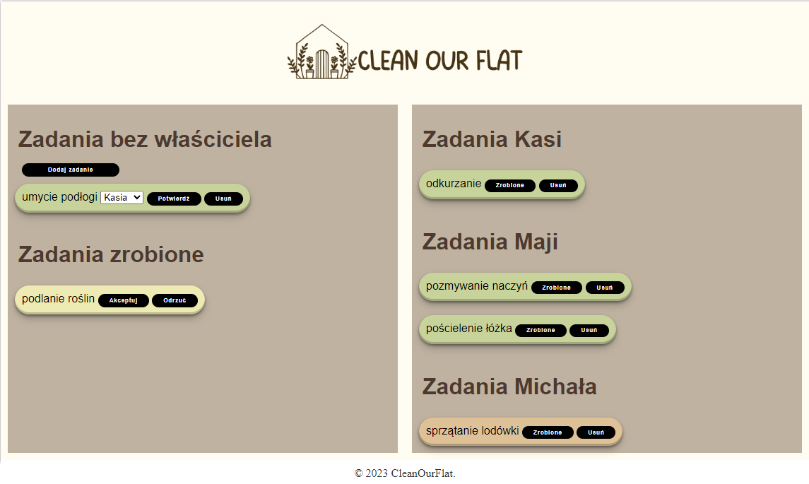

# CleanOurFlat

CleanOurFlat is one page web application. It uses MySQL database to store data. It was made to orginise a work in my own flat with my flatmates. 

Application has one sub-page with form to add new tasks to the board.

# Repository content

- `DataBase` is a folder with two SQL scripts. One creates tables, second one fills a example data;
- `Server` is a folder where server application files are stored. In this directory there are backend python files and sub-folders:
  - `Static` is sub-folder which contains style css files, java scripts files and logo image;
  - `Templates` is sub-folder which contains html template files.

# Installation

## Dependencies

- MySQL
- python 3
- flask
- MySQL Connector

## Running

1. Run the script `tworzenie_tabel.sql` in MySQL to create the tables. Optionally you can run also `uzupełnienie_tabel.sql` to have some test data.
2. In the file `connect_database.py` edit lines 5 - 7 to math with your database.
3. Run the script `flasks_endpoint.py` in python.
4. Go to the api address in web browser (ip is given by flask in terminal).